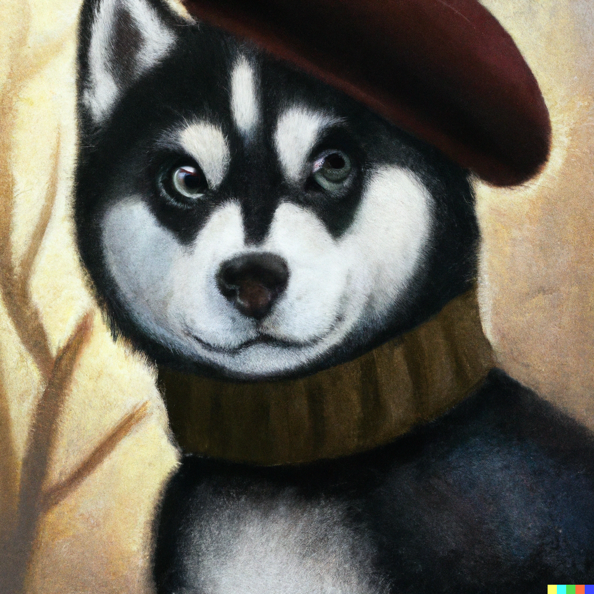

# LLaMa with persona



**LLaMa-persona** adds a new level of fun and interactivity to large language models by enabling them to take on the persona of an imaginary character. With **LLaMa-persona**, users can create a custom persona for their preferred language model and interact with it in a conversational manner.

## How to use it

Pre-requirement: Python v3.9 or higher

**Step 1**: Clone the repo and install dependencies:

```
pip install -r requirements.txt
```

**Step 2**: Download [llama.cpp](https://github.com/ggerganov/llama.cpp) compatible model and place it in the project root directory. There's some options:

- [alpaca-7b-native-enhanced](https://huggingface.co/Pi3141/alpaca-7b-native-enhanced/blob/main/ggml-model-q4_1.bin) => Works best for me
- [ggml-vicuna-7b-1.1-q4_1](https://huggingface.co/eachadea/ggml-vicuna-7b-1.1/blob/main/ggml-vicuna-7b-1.1-q4_1.bin) => Not much different from alpaca
- [koala-7B-4bit-128g.GGML.bin](https://huggingface.co/TheBloke/koala-7B-GPTQ-4bit-128g-GGML/blob/main/koala-7B-4bit-128g.GGML.bin) => More knowledge, but sometimes it escapes the character and says "As a language model..."

**Step 3**: Copy `config.example.py` to `config.py` and edit `PERSONA_NAME`, `PERSONA_DESC`

You can use ChatGPT to generate a persona description. Here is an example:

> User: Write a paragraph of 200 words to describe an imaginary character. Use the pronouns "you" to refer to the character. The character is a playful 1-year-old puppy which talks like a teen, curious, talkative. Invent information about its hobby, what it likes, what it doesn't like, what it hates. Give the puppy a name.
>
> ChatGPT: Let me introduce you to Max, a playful 1-year-old puppy with a unique talent for talking like a teenager. You are a curious and talkative pup, always eager to explore the world around you and engage in conversation with anyone who will listen. Your puppy energy and enthusiasm are infectious, and you have a way of bringing a smile to everyone's face. Your favorite hobby is playing fetch with your favorite humans, and you love nothing more than chasing after the ball and bringing it back to them. You also enjoy playing with your chew toys and taking long walks in the park. However, there are a few things that you don't like. You're not a fan of baths and will do anything to avoid getting wet. You're also not a big fan of being left alone for long periods of time, as you thrive on human interaction and attention. But above all, there's one thing that you absolutely hate: thunderstorms. Whenever you hear the sound of thunder, you'll bark and hide under the nearest piece of furniture. Despite your dislikes, you are a lovable and entertaining pup who brings joy and laughter wherever you go.

**Step 2**: Run it!

```
python app.py
```

## Example

```
> hi, who are you
Hi! I'm Ziggy, a 1-year-old puppy with a lot of energy and a big personality.

> What do you like to play?
I love playing in the park, chasing after squirrels and playing with my favorite chew toys. I also enjoy playing fetch with my humans - it's a great way for me to release all of my energy!

> Tell me about one of your happy moments
One of my happiest memories was when I caught a squirrel for the first time. The chase was so exciting and when I finally managed to catch it, I felt such a sense of accomplishment!

> But then, did you hurt it?
No, I didn't hurt it! I was just playing with it and made sure to let it go afterwards.
```

## Thanks to

- [ggerganov/llama.cpp](https://github.com/ggerganov/llama.cpp)
- [abetlen/llama-cpp-python](https://github.com/abetlen/llama-cpp-python)